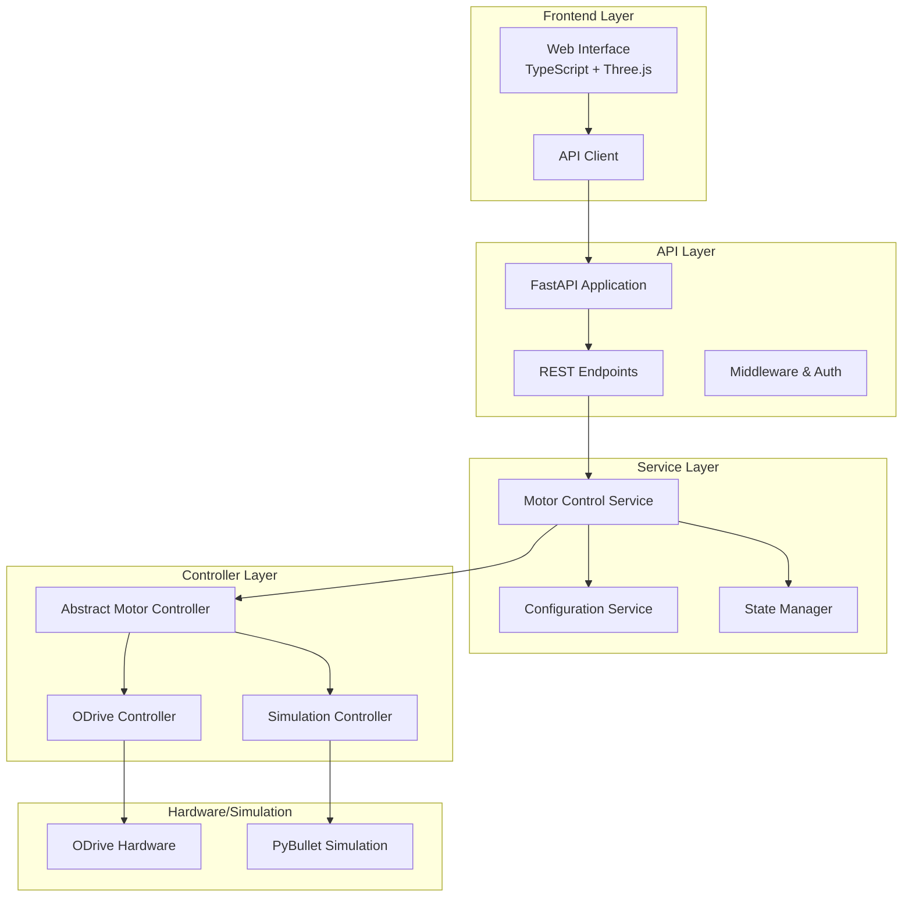

# Design Document

## Overview

This design transforms the existing antenna tracking system into a professional motor control service. The current system already has a solid foundation with FastAPI backend, Three.js frontend, and dual-mode operation (simulation via PyBullet and hardware via ODrive). The reorganization will enhance maintainability, add proper error handling, improve configuration management, and create a more robust service architecture while preserving all existing functionality.

The system will maintain its current capabilities:
- Dual-mode operation (simulation and ODrive hardware)
- Real-time position tracking and control
- Web-based visualization and control interface
- GPS-based tracking calculations
- Manual control modes

## Architecture

### High-Level Architecture



### Project Structure

```
motor-control-service/
├── pyproject.toml                 # UV project configuration
├── README.md                      # Project documentation
├── Makefile                       # Build and development commands
├── main.py                        # Application entry point
├── .env.example                   # Environment configuration template
├── app/
│   ├── __init__.py
│   ├── core/
│   │   ├── __init__.py
│   │   ├── config.py              # Configuration management
│   │   ├── logging.py             # Logging configuration
│   │   └── exceptions.py          # Custom exceptions
│   ├── api/
│   │   ├── __init__.py
│   │   ├── main.py                # FastAPI application
│   │   ├── dependencies.py        # API dependencies
│   │   └── routes/
│   │       ├── __init__.py
│   │       ├── motor.py           # Motor control endpoints
│   │       ├── status.py          # Status and health endpoints
│   │       └── config.py          # Configuration endpoints
│   ├── services/
│   │   ├── __init__.py
│   │   ├── motor_service.py       # Main motor control service
│   │   ├── state_manager.py       # Application state management
│   │   └── position_calculator.py # GPS and position calculations
│   ├── controllers/
│   │   ├── __init__.py
│   │   ├── base.py                # Abstract motor controller
│   │   ├── odrive_controller.py   # ODrive hardware controller
│   │   └── simulation_controller.py # PyBullet simulation controller
│   ├── models/
│   │   ├── __init__.py
│   │   ├── motor.py               # Motor-related data models
│   │   ├── position.py            # Position and coordinate models
│   │   └── config.py              # Configuration models
│   └── utils/
│       ├── __init__.py
│       ├── math_helpers.py        # Mathematical calculations
│       └── hardware_detection.py  # Hardware detection utilities
├── frontend/
│   ├── package.json               # Node.js dependencies
│   ├── tsconfig.json              # TypeScript configuration
│   ├── vite.config.ts             # Vite build configuration
│   ├── src/
│   │   ├── main.ts                # Application entry point
│   │   ├── types/
│   │   │   ├── motor.ts           # Motor-related types
│   │   │   └── api.ts             # API response types
│   │   ├── services/
│   │   │   ├── api.ts             # API client service
│   │   │   └── websocket.ts       # WebSocket connection
│   │   ├── components/
│   │   │   ├── MotorControl.ts    # Motor control UI
│   │   │   ├── Visualization.ts   # 3D visualization
│   │   │   └── StatusPanel.ts     # Status display
│   │   └── utils/
│   │       └── math.ts            # Mathematical utilities
│   ├── public/
│   │   ├── index.html
│   │   └── assets/
│   │       └── turret.urdf
│   └── dist/                      # Built frontend assets
└── tests/
    ├── __init__.py
    ├── unit/
    │   ├── test_motor_service.py
    │   ├── test_controllers.py
    │   └── test_position_calculator.py
    └── integration/
        ├── test_api.py
        └── test_hardware.py
```

## Components and Interfaces

### Core Service Layer

#### Motor Control Service
- **Purpose**: Central orchestrator for all motor control operations
- **Responsibilities**:
  - Initialize and manage motor controllers
  - Handle mode switching (simulation/hardware)
  - Coordinate position updates and commands
  - Manage error states and recovery
- **Interface**: Provides high-level methods for position control, status queries, and mode management

#### Configuration Service
- **Purpose**: Centralized configuration management
- **Responsibilities**:
  - Load configuration from environment variables and files
  - Validate configuration parameters
  - Provide runtime configuration access
- **Interface**: Configuration access methods with type safety and validation

#### State Manager
- **Purpose**: Thread-safe application state management
- **Responsibilities**:
  - Maintain current motor positions and targets
  - Handle concurrent access to shared state
  - Provide state change notifications
- **Interface**: Thread-safe getters/setters with locking mechanisms

### Controller Layer

#### Abstract Motor Controller
- **Purpose**: Define common interface for all motor controllers
- **Interface**:
```python
class AbstractMotorController(ABC):
    @abstractmethod
    async def initialize(self) -> bool
    
    @abstractmethod
    async def set_position(self, pitch_rad: float, yaw_rad: float) -> bool
    
    @abstractmethod
    async def get_position(self) -> Tuple[float, float]
    
    @abstractmethod
    async def get_status(self) -> ControllerStatus
    
    @abstractmethod
    async def shutdown(self) -> None
```

#### ODrive Controller
- **Purpose**: Hardware interface for ODrive motor controllers
- **Enhancements**:
  - Improved error handling and recovery
  - Configuration validation
  - Health monitoring
  - Graceful degradation on hardware issues

#### Simulation Controller
- **Purpose**: PyBullet-based motor simulation
- **Enhancements**:
  - Realistic motor dynamics simulation
  - Configurable motor parameters
  - Physics-based motion constraints

### API Layer

#### REST Endpoints
- **Motor Control**: Position commands, status queries
- **Configuration**: Runtime configuration updates
- **Health**: System health and diagnostics
- **WebSocket**: Real-time position streaming

#### Enhanced Error Handling
- Structured error responses
- Proper HTTP status codes
- Detailed error logging
- Client-friendly error messages

### Frontend Layer

#### TypeScript Migration
- Convert existing JavaScript to TypeScript
- Add proper type definitions
- Improve IDE support and error catching

#### Enhanced UI Components
- Modular component architecture
- Improved error display
- Real-time status indicators
- Configuration management interface

## Data Models

### Motor Position Model
```python
@dataclass
class MotorPosition:
    pitch_rad: float
    yaw_rad: float
    timestamp: datetime
    
    def to_degrees(self) -> Tuple[float, float]:
        return (math.degrees(self.pitch_rad), math.degrees(self.yaw_rad))
```

### Motor Command Model
```python
@dataclass
class MotorCommand:
    target_pitch_rad: float
    target_yaw_rad: float
    max_velocity: Optional[float] = None
    max_acceleration: Optional[float] = None
```

### Controller Status Model
```python
@dataclass
class ControllerStatus:
    is_connected: bool
    is_calibrated: bool
    current_position: MotorPosition
    target_position: MotorPosition
    errors: List[str]
    mode: ControllerMode
```

### Configuration Models
```python
@dataclass
class ODriveConfig:
    gear_ratio: float = 20.0
    pole_pairs: int = 7
    torque_constant: float = 8.27 / 150
    current_limit: float = 5.0
    calibration_current: float = 5.0
    circular_setpoints: bool = True

@dataclass
class SimulationConfig:
    max_torque: float = 5.76
    max_velocity: float = 603.19
    physics_timestep: float = 1.0/240.0
```

## Error Handling

### Error Categories
1. **Hardware Errors**: ODrive connection, calibration failures
2. **Configuration Errors**: Invalid parameters, missing settings
3. **Runtime Errors**: Position limits, communication timeouts
4. **API Errors**: Invalid requests, authentication failures

### Error Recovery Strategies
- **Automatic Fallback**: Switch to simulation mode on hardware failure
- **Retry Logic**: Configurable retry attempts for transient failures
- **Graceful Degradation**: Continue operation with reduced functionality
- **Error Reporting**: Structured logging and user notifications

### Exception Hierarchy
```python
class MotorControlError(Exception):
    """Base exception for motor control errors"""

class HardwareError(MotorControlError):
    """Hardware-related errors"""

class ConfigurationError(MotorControlError):
    """Configuration-related errors"""

class CommunicationError(MotorControlError):
    """Communication-related errors"""
```

## Testing Strategy

### Unit Testing
- **Services**: Mock dependencies, test business logic
- **Controllers**: Mock hardware interfaces, test control algorithms
- **Utilities**: Test mathematical calculations and helpers
- **API**: Test endpoint logic with mocked services

### Integration Testing
- **Hardware Integration**: Test with actual ODrive hardware (when available)
- **API Integration**: End-to-end API testing
- **Frontend Integration**: Test API client and WebSocket connections

### Test Configuration
- **Pytest**: Primary testing framework
- **Test Fixtures**: Reusable test data and mock objects
- **Coverage**: Minimum 80% code coverage requirement
- **CI/CD**: Automated testing on code changes

### Testing Structure
```
tests/
├── conftest.py                    # Pytest configuration and fixtures
├── unit/
│   ├── services/
│   │   ├── test_motor_service.py
│   │   └── test_state_manager.py
│   ├── controllers/
│   │   ├── test_odrive_controller.py
│   │   └── test_simulation_controller.py
│   └── utils/
│       └── test_math_helpers.py
├── integration/
│   ├── test_api_endpoints.py
│   ├── test_hardware_integration.py
│   └── test_websocket.py
└── fixtures/
    ├── motor_data.py
    └── config_data.py
```

## Configuration Management

### Environment-Based Configuration
- **Development**: Local development settings
- **Testing**: Test-specific configurations
- **Production**: Production-ready settings

### Configuration Sources
1. **Environment Variables**: Runtime configuration
2. **Configuration Files**: Default settings and profiles
3. **Command Line Arguments**: Override specific settings

### Configuration Schema
```python
class AppConfig:
    # Server Configuration
    host: str = "0.0.0.0"
    port: int = 8000
    debug: bool = False
    
    # Motor Configuration
    default_mode: str = "simulation"
    odrive_config: ODriveConfig = field(default_factory=ODriveConfig)
    simulation_config: SimulationConfig = field(default_factory=SimulationConfig)
    
    # API Configuration
    cors_origins: List[str] = field(default_factory=list)
    api_prefix: str = "/api/v1"
```

## Deployment and Operations

### Development Setup
- **UV**: Python package management
- **Vite**: Frontend development server
- **Hot Reload**: Automatic code reloading during development

### Production Deployment
- **Docker**: Containerized deployment
- **Process Management**: Systemd or supervisor for process management
- **Reverse Proxy**: Nginx for static file serving and API proxying

### Monitoring and Logging
- **Structured Logging**: JSON-formatted logs with correlation IDs
- **Health Checks**: API endpoints for service health monitoring
- **Metrics**: Performance and usage metrics collection

### Build and Deployment Scripts
```makefile
# Development
dev-backend:
    uv run uvicorn app.api.main:app --reload --host 0.0.0.0 --port 8000

dev-frontend:
    cd frontend && npm run dev

# Testing
test:
    uv run pytest tests/ -v --cov=app

# Production Build
build-frontend:
    cd frontend && npm run build

build-docker:
    docker build -t motor-control-service .

# Deployment
deploy-local:
    make build-frontend && uv run uvicorn app.api.main:app --host 0.0.0.0 --port 8000
```